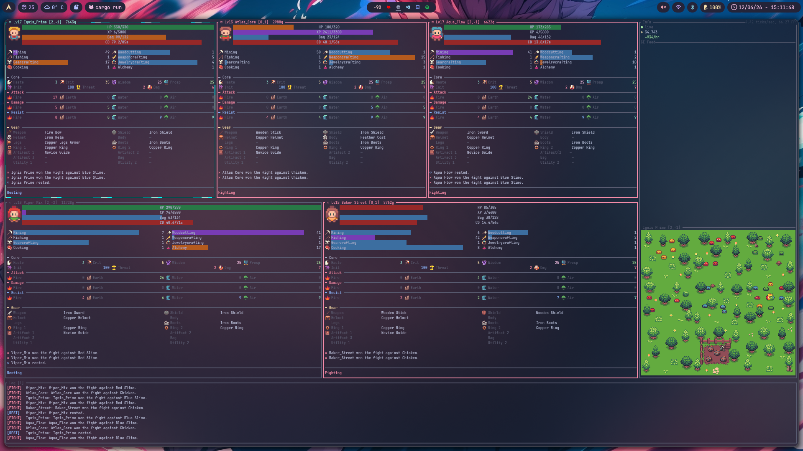

```
  ██████ ▓█████  ███▄    █ ▄▄▄█████▓ ██▓ ▓█████  ███▄    █ ▄▄▄█████▓
▒██    ▒ ▓█   ▀  ██ ▀█   █ ▓  ██▒ ▓▒▓██▒ ▓█   ▀  ██ ▀█   █ ▓  ██▒ ▓▒
░ ▓██▄   ▒███   ▓██  ▀█ ██▒▒ ▓██░ ▒░▒██▒ ▒███   ▓██  ▀█ ██▒▒ ▓██░ ▒░
  ▒   ██▒▒▓█  ▄ ▓██▒  ▐▌██▒░ ▓██▓ ░ ░██░ ▒▓█  ▄ ▓██▒  ▐▌██▒░ ▓██▓ ░ 
▒██████▒▒░▒████▒▒██░   ▓██░  ▒██▒ ░ ░██░ ░▒████▒▒██░   ▓██░  ▒██▒ ░ 
▒ ▒▓▒ ▒ ░░░ ▒░ ░░ ▒░   ▒ ▒   ▒ ░░   ░▓   ░░ ▒░ ░░ ▒░   ▒ ▒   ▒ ░░   
░ ░▒  ░ ░ ░ ░  ░░ ░░   ░ ▒░    ░     ▒ ░  ░ ░  ░░ ░░   ░ ▒░    ░     
░  ░  ░     ░      ░   ░ ░   ░       ▒ ░    ░      ░   ░ ░   ░       
      ░     ░  ░         ░           ░      ░  ░         ░           
                                                                    
                   ▄▄▄█████▓ █    ██  ██▓               
                   ▓  ██▒ ▓▒ ██  ▓██▒▓██▒               
                   ▒ ▓██░ ▒░▓██  ▒██░▒██▒               
                   ░ ▓██▓ ░ ▓▓█  ░██░░██░               
                     ▒██▒ ░ ▒▒█████▓ ░██░               
                     ▒ ░░   ░▒▓▒ ▒ ▒ ░▓                 
                       ░    ░░▒░ ░ ░  ▒ ░               
                     ░       ░░░ ░ ░  ▒ ░               
                               ░      ░                 
```

# Sentient TUI

A terminal UI client for [ArtifactsMMO](https://artifactsmmo.com) that provides real-time monitoring and management of your bot characters. Built with [ratatui](https://ratatui.rs/), [tachyonfx](https://crates.io/crates/tachyonfx), and an async [Tokio](https://tokio.rs/) runtime, it connects directly to the game's WebSocket feed and REST API to surface live character state, economy data, world events, and map tiles — all in your terminal.

## Features

| Feature | Description |
|---------|-------------|
| Real-time monitoring | Live character positions, levels, HP, gold, and active tasks via the official WebSocket |
| Character cards | 3-column adaptive grid showing stats, equipment, skills, and current action with per-card boot animations |
| Interactive minimap | 3×3 tile grid with sprite rendering, multi-layer support (overworld / underground / interior), and character portrait overlay |
| Grand Exchange feed | Live buy/sell orders and transaction completions streamed to the sidebar |
| World events | Real-time alerts for monster spawns and despawns |
| Economy dashboard | Total gold across all characters with gold-per-hour rate tracking |
| Action log | Colour-coded footer log covering combat, gathering, crafting, movement, tasks, banking, and GE activity |
| Image caching | Automatic background download and on-disk caching of character skins, item icons, effect sprites, and map tiles |
| Performance | 60 FPS rendering with configurable tick rate; semaphore-limited concurrent downloads; async Tokio runtime |
| Boot animation | Per-card tachyonfx glitch effect on startup with staggered content reveal |

## Screenshots



## Prerequisites

- **Rust toolchain** — Rust 2024 edition (1.85+). Install from [rustup.rs](https://rustup.rs/).
- **Terminal with image protocol support** — one of:
  - [Kitty](https://sw.kovidgoyal.net/kitty/) (recommended)
  - [iTerm2](https://iterm2.com/) (macOS)
  - [WezTerm](https://wezterm.org/)
  - [Konsole](https://konsole.kde.org/) (KDE)

  All other terminals fall back to Unicode half-block rendering automatically.
- **ArtifactsMMO account** — create one at [artifactsmmo.com](https://artifactsmmo.com) and generate an API token.

## Installation

### Pre-built binaries

Download the latest release for **Linux**, **macOS**, or **Windows** from the [GitHub Releases](https://github.com/jaintp/sentient-tui/releases) page.

| Archive | Platform |
|---------|----------|
| `sentient-tui-*-x86_64-unknown-linux-gnu.tar.gz` | Linux x86_64 |
| `sentient-tui-*-x86_64-apple-darwin.tar.gz` | macOS x86_64 |
| `sentient-tui-*-aarch64-apple-darwin.tar.gz` | macOS Apple Silicon |
| `sentient-tui-*-x86_64-pc-windows-msvc.zip` | Windows x86_64 |

### Arch Linux

A `PKGBUILD` is provided in the repository root:

```bash
git clone https://github.com/jaintp/sentient-tui.git
cd sentient-tui
makepkg -si
```

### From source

```bash
git clone https://github.com/jaintp/sentient-tui.git
cd sentient-tui
cargo build --release
# Binary: target/release/sentient-tui
```

## Configuration

### API token

`sentient-tui` requires an `ARTIFACTS_TOKEN` environment variable:

```bash
# Shell export
export ARTIFACTS_TOKEN="your-api-token-here"
sentient-tui

# Or inline
ARTIFACTS_TOKEN=your-api-token-here sentient-tui
```

A `.env` file in the working directory (or any parent) is loaded automatically:

```env
ARTIFACTS_TOKEN=your-api-token-here
```

### Optional: local bot API overrides

If you are running local bot servers (e.g. `artirust`), you can route character and map data through them instead of the official REST API. The live WebSocket feed is always sourced from the official endpoint.

```env
# Bot Control API — provides swarm status and character state
BOT_CONTROL_API_URL=http://127.0.0.1:8001

# Bot Sync API — provides map data and cached image assets
BOT_SYNC_API_URL=http://127.0.0.1:8002
```

### Config directory

| Platform | Path |
|----------|------|
| Linux | `~/.config/sentient-tui/` |
| macOS | `~/Library/Application Support/sentient-tui/` |
| Windows | `%APPDATA%\sentient-tui\` |

Override with environment variables:

```bash
export SENTIENT_TUI_CONFIG=/custom/config/path
export SENTIENT_TUI_DATA=/custom/data/path
```

## Usage

### Startup

```bash
ARTIFACTS_TOKEN=your-token sentient-tui
```

The loading screen runs while the application:
1. Fetches character data via REST (`GET /my/characters`)
2. Fetches map tiles via REST (`GET /maps`, paginated)
3. Downloads tile sprites to the image cache in the background
4. Establishes the WebSocket connection to `wss://realtime.artifactsmmo.com`

The main view appears once all four steps complete.

### Layout

```
+-------------------------------------+-------------+
|   Character Cards Grid (80%)        |  Sidebar    |
|                                     |  (20%)      |
|  [Card] [Card] [Card]               |  Status     |
|  [Card] [Card] [Card]               |  Economy    |
|                                     |  Events     |
|                                     |  GE Feed    |
|                                     |  Minimap    |
+-------------------------------------+-------------+
| Action Log (15%)                                  |
| [SYS]    system messages                          |
| [FIGHT]  combat  |  [GATHER]  gathering           |
| [CRAFT]  crafting  |  [GE]  grand exchange        |
+---------------------------------------------------+
```

**Character cards** adapt to available height and display (tallest-first):
- Character name, level, position, and gold
- HP / XP / Bag capacity / Cooldown progress bars
- Character skin portrait (when terminal supports image rendering)
- Skills grid with XP gauges
- Combat stats (attack, damage, resistances)
- Equipment table with item icon thumbnails
- Recent action history
- Current task / goal line

**Sidebar** (top to bottom): WebSocket status, economy summary, active world events, Grand Exchange feed, minimap.

**Footer log** colour codes:

| Tag | Colour | Event type |
|-----|--------|------------|
| `[SYS]` | Blue | System messages (WebSocket lifecycle) |
| `[FIGHT]` | Red | Combat actions |
| `[GATHER]` | Green | Gathering actions |
| `[CRAFT]` | Yellow | Crafting actions |
| `[MOVE]` | Cyan | Movement |
| `[REST]` | Blue | Rest / sleep |
| `[TASK+]` / `[TASK✓]` | Magenta | New task / completed task |
| `[GE]` | Cyan/Yellow | Grand Exchange orders and transactions |
| `[BANK]` | Gray | Bank deposits and withdrawals |
| `[ACHV]` | Light Yellow | Achievement unlocked |
| `[EVT+]` / `[EVT-]` | Green / Gray | Event spawn / despawn |
| `[IMG↓]` / `[IMG✓]` / `[IMG✗]` | Cyan / Green / Red | Image download status |

### Command-line options

```bash
sentient-tui --help
```

| Flag | Default | Description |
|------|---------|-------------|
| `--tick-rate FLOAT` | `4.0` | Game logic tick rate in Hz |
| `--frame-rate FLOAT` | `60.0` | Render frame rate in FPS |
| `--refresh-cache` | off | Wipe the on-disk image cache before starting |

Example:

```bash
ARTIFACTS_TOKEN=your-token sentient-tui --tick-rate 2.0 --frame-rate 30.0
```

### Keybindings

| Key | Action | Description |
|-----|--------|-------------|
| `q` | Quit | Exit the application |
| `j` / `↓` / `Tab` | FocusNext | Select next character card |
| `k` / `↑` / `Shift+Tab` | FocusPrev | Select previous character card |
| `l` | ToggleLog | Show / hide the footer log panel |

Keybindings are configurable via the config file. See [Config directory](#config-directory) for platform-specific paths.

## Architecture

### Overview

The application uses an event-driven, action-bus architecture on top of Tokio and ratatui:

```
┌──────────────────────────────────────────────────────┐
│  WebSocket Listener (background Tokio task)          │
│  wss://realtime.artifactsmmo.com                     │
│  → AccountLog, OnlineCharacters, EventSpawn, …       │
└────────────────────────┬─────────────────────────────┘
                         │ mpsc::UnboundedSender<Action>
                         ▼
              ┌──────────────────────┐
              │     App (main loop)  │
              │  handle_events()     │
              │  handle_actions()    │
              │  render()            │
              └────────┬─────────────┘
           ┌───────────┼───────────┐
           ▼           ▼           ▼
      GameState    ImageCache   Ratatui Frame
    Arc<RwLock>  Arc<Mutex>    (terminal output)
    characters   HTTP + disk
    map tiles    cache
    events, log

┌──────────────────────────────────────────────────────┐
│  REST Client (one-shot on startup)                   │
│  GET /my/characters   GET /maps (paginated)          │
└──────────────────────────────────────────────────────┘
```

### Key modules

| Module | File | Responsibility |
|--------|------|----------------|
| `App` | `src/app.rs` | Main event loop, action routing, mode transitions (Loading → Home) |
| `GameState` | `src/core/game/state.rs` | Central shared state (characters, map tiles, events, log) in `Arc<RwLock<>>` |
| `CharacterCards` | `src/ui/components/character_cards/` | Animated character card grid |
| `Sidebar` | `src/ui/components/sidebar.rs` | Status, economy, events, GE feed, minimap |
| `LogPanel` | `src/ui/components/log_panel.rs` | Scrollable action log with per-entry glitch effect |
| `LoadingScreen` | `src/ui/components/loading_screen.rs` | Boot splash with image-download progress gauge |
| `ImageCache` | `src/ui/image_cache.rs` | Semaphore-limited async downloads + on-disk cache |
| `MinimapCache` | `src/ui/minimap.rs` | 3×3 tile-sprite renderer with per-slot `StatefulProtocol` |
| `network` | `src/api/network.rs` | WebSocket listener with auto-reconnect and ping keepalive |
| `rest` | `src/api/rest.rs` | One-shot REST fetches for characters and map tiles |

### Action bus

All inputs, WebSocket messages, and internal state changes route through a single `mpsc::UnboundedChannel<Action>`. Key action categories:

| Category | Actions |
|----------|---------|
| Lifecycle | `Tick`, `Render`, `Quit`, `Suspend`, `Resume` |
| WebSocket | `WsConnected`, `WsDisconnected`, `WsConnect` |
| REST | `CharactersFetched`, `MapsFetched` |
| Game events | `AccountLog`, `OnlineCharacters`, `EventSpawn`, `EventRemoved` |
| Grand Exchange | `GEOrderCreated`, `GETransactionCompleted` |
| Notifications | `AchievementUnlocked`, `Announcement` |
| System | `SystemLog` (image download progress) |

## Cache

### Image cache

Downloaded sprites are stored at:

```
~/.cache/sentient-tui/images/{category}/{code}.png
```

| Category | Content |
|----------|---------|
| `characters` | Character skin portraits |
| `items` | Equipment and inventory item icons |
| `effects` | Stat/effect icons used in the stats panel |
| `skills` | Skill icons used in the skills panel |
| `maps` | Map tile sprites for the minimap |

Force a full re-download:

```bash
sentient-tui --refresh-cache
# Or manually:
rm -rf ~/.cache/sentient-tui/images/
```

### Application logs

```
~/.local/share/sentient-tui/sentient-tui.log   # Linux
~/Library/Logs/sentient-tui/sentient-tui.log   # macOS
%APPDATA%\sentient-tui\sentient-tui.log         # Windows
```

Control log verbosity:

```bash
export RUST_LOG=sentient_tui=debug
```

## License

This project is licensed under the terms in the [LICENSE](LICENSE) file.

## Contributing

Contributions are welcome. Please open an issue to discuss significant changes before submitting a pull request.

## Acknowledgments

- [Exabind](https://github.com/junkdog/exabind) — inspiration for the component animation system.
- [tachyonfx](https://github.com/junkdog/tachyonfx) — the Rust TUI effects library powering the boot animations.

## Resources

- [ArtifactsMMO](https://artifactsmmo.com) — official game site
- [ArtifactsMMO API docs](https://docs.artifactsmmo.com) — REST and WebSocket documentation
- [Ratatui book](https://ratatui.rs/) — Rust TUI framework documentation
- [Tokio](https://tokio.rs/) — async runtime
